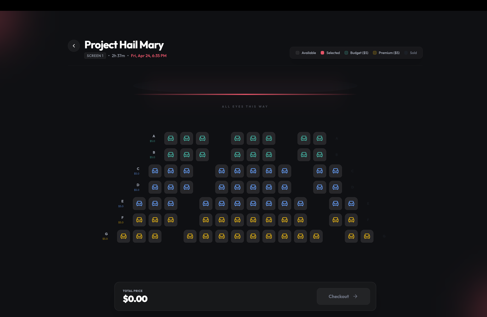
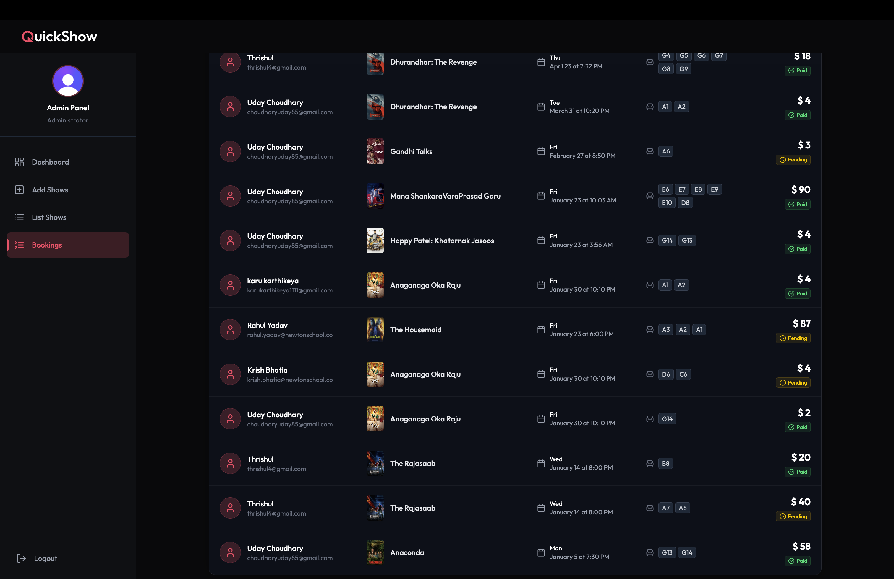

# QuickShow -- Movie Ticket Booking Platform

QuickShow is a full-stack movie ticket booking system where users can browse now-playing films, pick seats from an interactive layout, and pay through Stripe. An admin panel lets theater operators create shows, manage listings, and track every booking in real time.

The project handles the hard parts of online ticketing: **atomic seat locking** to prevent double bookings, **automatic seat release** when payments time out, and **transactional email notifications** on every successful purchase. It is built with React 19 on the frontend and Express 5 with MongoDB on the backend.


---

## Screenshots

### Home Page

The landing page features a hero carousel that cycles through currently playing movies. Each slide shows the movie backdrop, genres, rating, runtime, and a direct "Book Now" call-to-action. Below the hero sits a featured movies grid and a trailers section with embedded YouTube playback.


### Movie Details and Booking

Clicking into a movie opens its detail view with the full synopsis, cast list, TMDB rating, and available showtimes. Users can book tickets, watch the trailer inline, or save the movie to their favorites.


### Seat Selection

The seat layout page renders a theater-style grid with row labels and per-seat pricing. Seats are color-coded by tier (Budget / Premium) and availability status (Available / Selected / Sold). A live price total updates as seats are toggled, and the checkout button redirects to Stripe.



### Admin Panel -- Show Management

Administrators access a dedicated dashboard behind Clerk authentication. The "Add Shows" page pulls the full now-playing catalog from TMDB, lets the admin pick a movie, set ticket prices, choose dates, and assign showtimes.


### Admin Panel -- Booking List

The bookings view gives admins a complete ledger: user info, movie title, showtime, assigned seats, total amount, and payment status (Paid / Pending) -- all in a single scrollable table.



### System Architecture -- Booking Flow

The sequence diagram below traces a ticket purchase end-to-end: from seat selection on the frontend, through the atomic `findOneAndUpdate` check on MongoDB, Stripe Checkout session creation, webhook confirmation, and the Inngest background timer that releases unpaid seats after 7 minutes.


---

## Features

### For Users

- **Browse Movies** -- Live now-playing data pulled from the TMDB API (Indian region).
- **Movie Details** -- Full synopsis, cast, genres, runtime, rating, and tagline sourced from TMDB.
- **Interactive Seat Selection** -- Theater-style grid with Budget and Premium tiers, real-time occupied seat updates.
- **Stripe Checkout** -- Secure payment flow with webhook-verified confirmation.
- **Timed Seat Locks** -- Selected seats are held for 7 minutes; if payment is not completed, they are automatically released back to inventory.
- **Email Confirmations** -- HTML booking receipts sent via Nodemailer on successful payment.
- **Show Reminders** -- Cron-based reminder emails fired 8 hours before showtime.
- **Favorites** -- Save movies to a personal favorites list for quick access later.
- **Trailers** -- Watch YouTube trailers directly within the app using React Player.
- **My Bookings** -- View booking history, payment status, and retry failed payments.

### For Admins

- **Show Creation** -- Select a movie from TMDB, set pricing, pick multiple dates/times, and bulk-create show entries.
- **Show Listings** -- View and manage all upcoming shows.
- **Booking Overview** -- Monitor every booking across all shows with user details, seat assignments, and payment status.
- **New Show Notifications** -- When a show is added, every registered user gets an email blast automatically.

### Technical

- **Atomic Concurrency Control** -- Seat booking uses MongoDB's `findOneAndUpdate` with `$exists: false` checks to prevent race conditions. Two users cannot book the same seat.
- **Background Job Engine** -- Inngest handles delayed seat release, email dispatch, user sync from Clerk, and show reminders as durable, retriable step functions.
- **Webhook-Driven Architecture** -- Stripe payment confirmations and Clerk user lifecycle events are processed through verified webhooks.
- **Fallback User Sync** -- If the Clerk webhook fails to create a user document in time, the booking controller performs an inline sync before checkout.

---

## Tech Stack

### Frontend

| Concern         | Library                        |
| --------------- | ------------------------------ |
| Framework       | React 19.1                     |
| Build Tool      | Vite 7.1                       |
| Routing         | React Router DOM 7.8           |
| Styling         | TailwindCSS 4.1                |
| Auth            | Clerk React 5.45               |
| HTTP            | Axios 1.13                     |
| Icons           | Lucide React                   |
| Notifications   | React Hot Toast                |
| Video Playback  | React Player / React YouTube   |

### Backend

| Concern           | Library              |
| ----------------- | -------------------- |
| Runtime           | Node.js              |
| Framework         | Express 5.1          |
| Database          | MongoDB (Mongoose 8) |
| Auth              | Clerk Express 1.7    |
| Payments          | Stripe 20.1          |
| Email             | Nodemailer 7.0       |
| Background Jobs   | Inngest 3.48         |
| Media Storage     | Cloudinary 2.7       |
| Webhook Verify    | Svix 1.82            |

---

## Project Structure

```
QuickShow/
├── client/
│   ├── src/
│   │   ├── components/        # Navbar, Footer, HeroSection, MovieCard, SeatLayout pieces, etc.
│   │   ├── pages/             # Home, Movies, MovieDetails, SeatLayout, MyBookings, Favorite, Theaters
│   │   │   └── admin/         # Dashboard, AddShows, ListShows, ListBookings, Layout
│   │   ├── context/           # Global app context (auth state, API base URL)
│   │   ├── lib/               # Utility helpers
│   │   └── assets/            # Static images and icons
│   ├── index.html
│   ├── vite.config.js
│   └── vercel.json
│
├── server/
│   ├── config/                # db.js (MongoDB connection), nodeMailer.js (SMTP transport)
│   ├── controllers/           # showController, bookingController, adminController, userController, stripeWebhooks
│   ├── models/                # Booking, Show, Movies, User (Mongoose schemas)
│   ├── routes/                # showRoutes, bookingRoutes, adminRoutes, userRoutes
│   ├── middleware/            # auth.js (Clerk token verification)
│   ├── inngest/               # Background functions: seat release, email, user sync, reminders, notifications
│   ├── server.js              # Express app entry point
│   └── vercel.json
│
└── QuickShowUI/               # Screenshots and architecture diagrams
```

---

## Getting Started

### Prerequisites

- Node.js v18 or higher
- A MongoDB database (local or Atlas)
- Accounts on: [Clerk](https://clerk.dev), [Stripe](https://stripe.com), [TMDB](https://www.themoviedb.org/documentation/api), [Cloudinary](https://cloudinary.com)
- An SMTP email account (Gmail app password works fine)

### Environment Variables

Create a `.env` file inside the `client/` directory:

```env
VITE_CLERK_PUBLISHABLE_KEY=your_clerk_publishable_key
VITE_API_URL=http://localhost:3000
```

Create a `.env` file inside the `server/` directory:

```env
PORT=3000
MONGODB_URI=your_mongodb_connection_string

# Clerk
CLERK_PUBLISHABLE_KEY=your_clerk_publishable_key
CLERK_SECRET_KEY=your_clerk_secret_key
CLERK_WEBHOOK_SECRET=your_clerk_webhook_secret

# Stripe
STRIPE_SECRET_KEY=your_stripe_secret_key
STRIPE_WEBHOOK_SECRET=your_stripe_webhook_secret

# TMDB
TMDB_API_KEY=your_tmdb_api_key

# Cloudinary
CLOUDINARY_CLOUD_NAME=your_cloud_name
CLOUDINARY_API_KEY=your_cloudinary_api_key
CLOUDINARY_API_SECRET=your_cloudinary_api_secret

# Email (Nodemailer)
EMAIL_USER=your_email@gmail.com
EMAIL_PASS=your_app_password
EMAIL_HOST=smtp.gmail.com
EMAIL_PORT=587

# Inngest
INNGEST_EVENT_KEY=your_inngest_event_key
INNGEST_SIGNING_KEY=your_inngest_signing_key

# Frontend origin (for CORS and redirect URLs)
CLIENT_URL=http://localhost:5173
```

### Installation

```bash
# Clone the repository
git clone https://github.com/Uday-Choudhary/QuickShow.git
cd QuickShow

# Install server dependencies
cd server
npm install

# Install client dependencies
cd ../client
npm install
```

### Running Locally

Open two terminal windows:

```bash
# Terminal 1 -- Start the backend
cd server
npm run dev          # runs on http://localhost:3000
```

```bash
# Terminal 2 -- Start the frontend
cd client
npm run dev          # runs on http://localhost:5173
```

---

## API Reference

### Public

| Method | Endpoint                          | Description                     |
| ------ | --------------------------------- | ------------------------------- |
| GET    | `/`                               | Health check                    |
| GET    | `/api/shows/now-playing`          | Now-playing movies from TMDB    |
| GET    | `/api/shows/trailers`             | Upcoming movie trailers         |
| GET    | `/api/shows/:movieId`             | Showtimes for a specific movie  |
| GET    | `/api/shows/:movieId/trailer`     | Single movie trailer key        |

### Authenticated (Clerk JWT required)

| Method | Endpoint                          | Description                          |
| ------ | --------------------------------- | ------------------------------------ |
| GET    | `/api/shows`                      | All upcoming shows                   |
| POST   | `/api/booking/create`             | Create booking and redirect to Stripe|
| POST   | `/api/booking/retry-payment`      | Retry payment for a pending booking  |
| POST   | `/api/booking/verify`             | Verify payment status manually       |
| GET    | `/api/user/favorites`             | Get user's favorite movies           |
| POST   | `/api/user/favorites`             | Add a movie to favorites             |
| DELETE | `/api/user/favorites/:movieId`    | Remove a movie from favorites        |

### Admin

| Method | Endpoint                          | Description                     |
| ------ | --------------------------------- | ------------------------------- |
| POST   | `/api/admin/shows`                | Add new show(s)                 |
| PUT    | `/api/admin/shows/:id`            | Update a show                   |
| DELETE | `/api/admin/shows/:id`            | Delete a show                   |
| GET    | `/api/admin/bookings`             | List all bookings               |

### Webhooks

| Endpoint         | Source  | Purpose                                    |
| ---------------- | ------- | ------------------------------------------ |
| `/api/stripe`    | Stripe  | Payment confirmation (`checkout.session.completed`) |
| `/api/inngest`   | Inngest | Background function execution              |

---

## How the Booking Flow Works

1. **Seat Selection** -- The user picks seats on the interactive layout. Each seat's availability is fetched live from the `occupiedSeats` map on the Show document.

2. **Atomic Lock** -- On checkout, the server runs a single `findOneAndUpdate` query that checks every requested seat has `$exists: false` in the `occupiedSeats` object. If even one seat was grabbed by another user in the meantime, the entire update fails and the user is told to pick different seats. This eliminates race conditions without external locking.

3. **Booking Created (Unpaid)** -- A Booking document is created with `isPaid: false`. At the same time, an Inngest event (`booking.created`) is fired.

4. **Stripe Checkout** -- The user is redirected to a Stripe Checkout session. The session metadata carries the `bookingId`.

5. **Payment Confirmed** -- Stripe sends a `checkout.session.completed` webhook. The server marks the booking as paid, clears the payment link, and fires an `app/show.booked` Inngest event.

6. **Confirmation Email** -- Inngest picks up the `app/show.booked` event, fetches the full booking details with populated movie and user data, and sends a styled HTML receipt to the user's email.

7. **Timeout Release** -- If the user never completes payment, the Inngest function that was triggered in step 3 wakes up after 7 minutes, checks `isPaid`, and if still false, removes the seats from `occupiedSeats` and marks the booking as Cancelled. The seats go back into inventory for other users.

---

## Deployment

Both the client and server include `vercel.json` configs for one-command deployment to Vercel.

```bash
# Deploy server
cd server && vercel

# Deploy client
cd client && vercel
```

After deploying, update these values:
- Set `VITE_API_URL` in the client's Vercel environment to the production server URL.
- Set `CLIENT_URL` in the server's Vercel environment to the production client URL.
- Update webhook endpoints in the Stripe and Clerk dashboards to point to your production server.

---

## Testing Email Setup

A standalone script is included to verify your SMTP configuration before going live:

```bash
cd server
node test-email.js
```

---

## Contributing

1. Fork the repository
2. Create a feature branch (`git checkout -b feature/your-feature`)
3. Commit your changes (`git commit -m 'Add your feature'`)
4. Push to the branch (`git push origin feature/your-feature`)
5. Open a Pull Request

---

## License

ISC

---

## Author

**Uday Kumar Choudhary**
- GitHub: [Uday-Choudhary](https://github.com/Uday-Choudhary)
- Email: choudharyuday85@gmail.com

---

## Acknowledgments

- [TMDB](https://www.themoviedb.org/) for the movie database API
- [Clerk](https://clerk.dev/) for authentication
- [Stripe](https://stripe.com/) for payment processing
- [Inngest](https://www.inngest.com/) for durable background functions
- [Cloudinary](https://cloudinary.com/) for media storage
